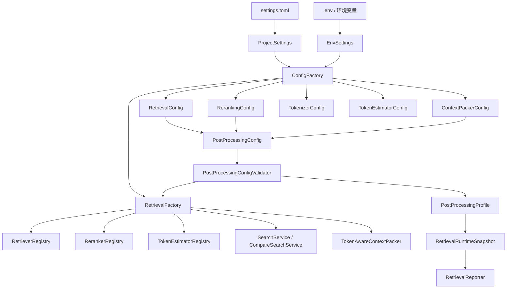
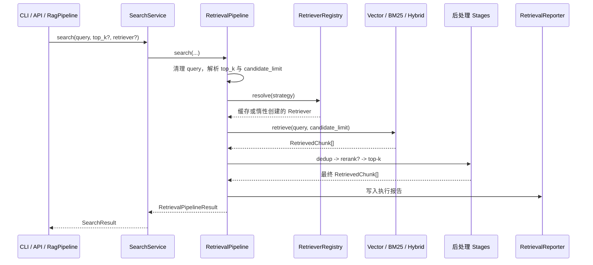
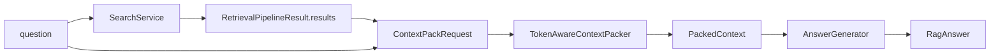

# Retrieval 模块处理流程说明

本文档描述当前 `app/retrieval` 的真实运行流程、数据对象如何在各子功能之间流动，以及它与 Factory、在线 RAG Pipeline、报告组件和 API 契约之间的边界。

本文不描述离线摄取、切分、embedding 和索引构建的内部过程；它们的产物 `RagIndex`、`ChunkCollection` 和 `VectorCollection` 是 retrieval 的输入。回答生成也不属于 retrieval 的职责，但 retrieval 产生的 `RetrievedChunk` 和 `PackedContext` 会直接成为生成阶段的证据输入。

## 1. 模块目标与边界

Retrieval 的职责不是“直接回答问题”，而是把用户 query 转换为一组有顺序、有来源、可诊断的证据片段。

```text
离线索引产物
  RagIndex
    ├─ EmbeddingClient
    ├─ VectorCollection
    ├─ ChunkCollection
    └─ IndexManifest

在线 retrieval
  query -> RetrievedChunk[] -> RetrievalPipelineResult

在线 RAG
  RetrievalPipelineResult.results
    -> TokenAwareContextPacker
    -> PackedContext
    -> AnswerGenerator
    -> RagAnswer
```

边界约束：

1. `Retriever` 只负责召回候选，不负责 rerank、上下文预算、Citation 或回答生成。
2. `RetrievalPipeline` 负责候选召回后的通用编排：去重、可选 rerank、最终 `top_k` 截断、trace 和检索报告。
3. `TokenAwareContextPacker` 位于 retrieval 软件包，但它服务的是“检索结果进入生成模型前”的证据组织，不参与向量检索或 BM25 评分。
4. `AnswerGenerator` 只接收已经组织好的 `PackedContext`，不应该自行访问向量集合或重新检索。
5. 具体策略由 Registry 和 Factory 组装；pipeline 中不根据策略名编写 `if strategy == ...`。

## 2. 软件包分工

```text
app/retrieval/
  pipeline.py          单策略检索与多策略比较的流程编排
  pipeline_types.py    各后处理 stage 共享的窄类型契约
  comparison/          compare search 的领域结果模型
  configuration/       检索 Config 与跨配置后处理校验/Profile
  services/            SearchService、CompareSearchService 等应用服务
  context/             ContextPacker 与 token estimator
  retrievers/          候选召回：vector、BM25、hybrid 与 RRF 融合
  rerankers/           已召回候选的相关性重排序
  tokenizers/          BM25 与 lexical reranker 使用的分词能力
  reporting/           单策略与多策略比较的 JSON 报告
```

`pipeline_types.py` 不承载业务行为，只定义 `RetrievalPipelineContext` 与 `RetrievalStageResult`。这样 `RetrievalPipeline` 可以调用 `RerankStage`，而 `RerankStage` 又能依赖稳定的 stage 输入输出类型，不会形成 `pipeline -> stage -> pipeline` 的循环导入。根级 `pipeline.py` 只承载 retrieval 的流程编排，不承担策略实现或应用服务职责。

## 3. 对象创建与配置流

所有对象从 `ApplicationFactory` 这个组合根向下组装。业务对象不会直接读取 `settings.toml`，也不会自行构造隐式默认依赖。



### 3.1 Settings 到 Config

`ProjectSettings` 负责读取 `settings.toml` 中的结构化行为配置；`EnvSettings` 只负责 API key 等敏感信息。`ConfigFactory` 将 Settings 转换为功能类真正接收的不可变 Config：

```text
RetrievalSettings         -> RetrievalConfig
RerankingSettings         -> RerankingConfig
ContextPackingSettings    -> ContextPackerConfig
TokenizerSettings         -> TokenizerConfig
TokenEstimatorSettings    -> TokenEstimatorConfig
```

`PostProcessingConfig` 不新增配置字段。它只是聚合前三项 Config，以便集中表达“单个字段合法，但组合后没有意义”的规则。

### 3.2 后处理组合校验

`RetrievalFactory.build_postprocessing_config()` 在构造 SearchService、CompareSearchService 或 ContextPacker 前执行 `PostProcessingConfigValidator`。当前校验规则如下：

1. 启用 rerank 时，`candidate_limit >= retrieval.top_k`；否则默认候选宽度小于最终返回数，配置语义自相矛盾。
2. `model_context_window` 必须大于固定预留项 `reserved_prompt_tokens + reserved_output_tokens + safety_margin_tokens`；否则没有任何资料上下文空间。
3. `max_context_tokens` 不能超过空问题下的静态可用资料预算；避免 ContextPacker 在运行时悄悄把用户期望的上限压缩为更小值。

校验失败统一转换为 `AppError(INVALID_CONFIG)`。因此错误会在 Factory 组装阶段暴露，而不是等到某个请求进入底层组件才出现。

### 3.3 同一 RAG Pipeline 的配置一致性

`PipelineFactory.build_rag_pipeline()` 会先获取一份已验证的 `PostProcessingConfig`，再把同一对象传入：

```text
SearchService
TokenAwareContextPacker
```

这保证一次在线问答中，检索阶段与上下文打包阶段使用同一份后处理配置快照。`PostProcessingProfile` 是该快照的只读描述，写入检索报告的 `runtime.config.postprocessing`。

## 4. 核心数据对象与数据流

| 对象 | 来源 | 主要承载内容 | 下游消费者 |
|---|---|---|---|
| `DocumentChunk` | 离线 ingest/chunking | 原文、文档身份、页码、章节、metadata | BM25Index、ChunkCollection |
| 向量搜索命中 | `VectorCollection.search` | `chunk_id`、相似度、rank | `VectorRetriever` |
| `BM25SearchHit` | `BM25Index.search` | `DocumentChunk`、BM25 分数、rank | `BM25Retriever` |
| `RetrievedChunk` | `RetrievedChunkBuilder` 或 hybrid 融合 | 统一文本、来源、score、rank、signals | 后处理 stage、API、ContextPacker |
| `RerankSignal` | `RerankStage` | reranker 名称、rerank 分数、rerank 后 rank | `RetrievedChunk.rerank_signal`、报告、API |
| `RetrievalPipelineResult` | `RetrievalPipeline.search` | query、策略、candidate limit、top-k、结果、trace、报告路径 | SearchService、RagPipeline、compare pipeline |
| `ContextCandidate` | ContextPacker 内部 | 一个或多个相邻 `RetrievedChunk` 的候选文本 | token 预算处理 |
| `ContextSegment` | ContextPacker | 最终文本段、完整 source chunk id、页码范围、章节、token 数 | Citation、PackedContext、后续引用校验 |
| `PackedContext` | ContextPacker | 上下文文本、Citation、已用/丢弃 chunk、segments、token usage | AnswerGenerator |

`RetrievedChunk.score` 始终保留原召回器的分数：向量相似度、BM25 分数或 RRF 融合分数。rerank 分数不覆盖它，而是写入独立的 `rerank_signal`，避免把不同量纲的分数混为同一种指标。

## 5. 单策略检索流程

单策略检索被 `/search`、CLI `search`、`RagPipeline.ask()` 和 compare search 的子请求共同使用。



### 5.1 请求参数解析

`RetrievalPipeline.search()` 先处理以下运行时参数：

```text
query
  去除首尾空白；空 query 直接抛出 RETRIEVAL_FAILED。

top_k
  调用方未传时使用 RetrievalConfig.top_k；必须大于 0。

retriever
  调用方未传时使用 RetrievalConfig.strategy；策略实际合法性由 RetrieverRegistry 校验。
```

候选召回宽度 `candidate_limit` 的解析规则：

```text
rerank 关闭：candidate_limit = top_k
rerank 开启：candidate_limit = max(top_k, RerankingConfig.candidate_limit)
```

前者保持普通检索的原始行为；后者让 reranker 先观察更宽的候选集合，再由最终 `TopKLimitStage` 返回调用方需要的数量。

### 5.2 RetrieverRegistry 的解析与缓存

`RetrieverRegistry` 由 `RetrievalFactory` 注册内置 provider：

```text
vector -> VectorRetriever
bm25   -> BM25Retriever
hybrid -> HybridRetriever(vector retriever + bm25 retriever + RRF)
```

Registry 在第一次 `resolve(name)` 时调用 provider，验证对象具有 `retrieve()`，并在当前 Registry 生命周期内缓存实例。它还会检测 provider 递归解析造成的循环依赖。这样 hybrid 可以复用已创建的 vector 与 BM25 retriever，而 pipeline 不需要知道它们的构造细节。

### 5.3 三种召回策略

#### VectorRetriever

```text
query
  -> EmbeddingClient.embed_text(query)
  -> query_vector
  -> VectorCollection.search(query_vector, top_k)
  -> vector hits(chunk_id, score, rank)
  -> ChunkCollection.get_by_id(chunk_id)
  -> RetrievedChunkBuilder.from_chunk(..., retriever="vector")
  -> RetrievedChunk[]
```

向量集合只保存向量和必要的命中信息，实际文本从 `ChunkCollection` 取得。若向量命中对应的 chunk 不存在，系统抛出 `RETRIEVAL_FAILED`，而不是返回缺少正文的半成品结果。

#### BM25Retriever

`BM25Index` 在 Factory 构建 BM25Retriever 时，基于 `ChunkCollection.iter_chunks()` 建立内存统计信息：分词结果、词频、文档频率和平均文档长度。

```text
DocumentChunk[] + Tokenizer + BM25Config
  -> BM25Index

query
  -> Tokenizer.tokenize(query)
  -> BM25 对每个 chunk 计算分数
  -> 按 score 降序取 top-k
  -> BM25SearchHit[]
  -> RetrievedChunkBuilder.from_chunk(..., retriever="bm25")
  -> RetrievedChunk[]
```

`Tokenizer` 与 lexical reranker 共享相同的默认 regex 策略，但它们的功能边界不同：Tokenizer 用于词项统计和查询词匹配，不用于生成模型上下文预算。

#### HybridRetriever

```text
query + pipeline candidate_limit
  -> 每个 source 以 candidate_limit * candidate_multiplier 召回
       ├─ VectorRetriever
       └─ BM25Retriever
  -> RankedResultSet[]
  -> ReciprocalRankFusion.fuse(..., limit=candidate_limit)
  -> 重新设置 rank、score、retriever="hybrid"
  -> 在 retrieval_signals 中保留各召回源的证据
  -> RetrievedChunk[]
```

Hybrid 的职责是“多召回源融合”，而不是完整检索流程。它不会执行去重、rerank、上下文打包或回答生成。

### 5.4 后处理 Stages

Retriever 返回的候选统一进入 `RetrievalPipeline` 的 stage 链：

```text
RetrievedChunk[]
  -> ChunkIdDeduplicationStage（由 RetrievalConfig 控制）
  -> RerankStage（由 RerankingConfig.enabled 控制）
  -> TopKLimitStage（始终执行）
  -> 最终 RetrievedChunk[]
```

#### ChunkIdDeduplicationStage

按 `chunk_id` 保留第一次出现的结果，并重新分配连续 rank。它解决多个召回源或底层存储重复返回同一 chunk 的情况。该阶段只处理检索身份重复，不做文本相似去重；文本内容重复的处理属于 ContextPacker。

#### RerankStage

Rerank 接收 `query + 已召回候选`，并只重新排序，不改变候选集合成员：

```text
RetrievedChunk[]
  -> Reranker.rerank(query, candidates, limit)
  -> RerankedCandidate[]
  -> 重新设置 RetrievedChunk.rank
  -> 写入 RerankSignal
  -> RetrievedChunk[]
```

`RerankStage` 会校验外部 reranker 的输出：不能有未知 chunk、不能重复、不能遗漏原候选。当前内置实现是 `LexicalReranker`，真实 cross-encoder 可以通过 `RerankerRegistry` 注册进入，不需要修改 pipeline。

失败语义由 `failure_mode` 决定：

```text
fail_open
  保留 rerank 前的候选顺序。
  该 stage 仍完成，但 trace/report detail 中记录 degraded=true 和错误信息。

fail_closed
  抛出 RERANK_FAILED。
  RetrievalPipeline 写入失败报告并将错误交给上层。
```

#### TopKLimitStage

它不判断相关性，只执行最终数量约束：保留当前排序前 `top_k` 个结果。将其保持为独立 stage 可以稳定保证 API、CLI、RagPipeline 和 compare search 的返回数量，而不用让每个 reranker 或 retriever 都实现相同截断逻辑。

### 5.5 单策略输出、trace 与报告

成功时，`RetrievalPipeline` 返回：

```text
RetrievalPipelineResult
  query
  retriever
  candidate_limit
  top_k
  results: RetrievedChunk[]
  trace: RagTrace
  report_path: Path | None
```

每个阶段都会在 retrieval trace 中写入耗时、输入/输出数量和 detail。`RetrievalReporter` 启用时，会将以下内容写入 `logs/retrieval` 或配置指定目录：

```text
request
  query、请求与解析后的 top-k、candidate limit、retriever
counts
  candidate_count、deduplicated_count、returned_count
stages
  每个检索或后处理阶段的状态、耗时、detail
results
  结果来源、原始 score、retrieval_signals、rerank_signal
runtime
  索引快照、检索配置、PostProcessingProfile、已注册策略
trace
  最终状态、失败信息、阶段记录
```

如果检索、阶段执行或报告写入失败，pipeline 尽可能先写入最终失败报告，再抛出带 retrieval trace id 的 `AppError`。报告写入是否会让请求失败由 `RetrievalReportConfig.fail_on_write_error` 控制。

## 6. Compare Search 流程

Compare search 不会把多个策略的分数混合成一份结果。它是用于比较召回行为的并列执行流程。

```text
CompareSearchService
  -> RetrievalComparisonPipeline
  -> 对每个 strategy 调用同一个 RetrievalPipeline.search(...)
       -> 每个策略得到独立 results、trace 和子报告
  -> 按 chunk_id 计算命中交集与各策略 rank
  -> 生成父级 RetrievalComparisonResult
  -> 写入 compare 聚合报告
```

状态规则：

```text
所有策略成功      -> success
部分策略失败      -> partial_error
所有策略失败      -> error
```

单个策略失败不会阻止其余策略执行。父级 comparison trace 会保留每个子请求的 `child_trace_id`、报告路径、失败信息和最终 overlap 数量；聚合报告只引用各子报告路径，不复制全部子报告正文。

## 7. RAG 问答中的 Context Packing 流程

`RagPipeline.ask(question)` 复用 `SearchService.search()`。Retrieval 完成后，结果才进入 `TokenAwareContextPacker`：



### 7.1 TokenEstimator 的触发位置

`TokenEstimator` 只在 ContextPacker 内使用，发生在 retrieval 的 `TopKLimitStage` 完成之后。它不参与向量检索、BM25 或 rerank。

```text
question
  -> TokenEstimator.count_text(question)
  -> 计算可用资料 token 预算

每个候选段、分隔符、Citation 前缀、截断尝试
  -> TokenEstimator.count_text(...)
  -> 决定完整保留、截断或丢弃
```

TokenEstimator 通过 `TokenEstimatorRegistry` 创建。当前内置 `RegexTokenEstimator` 是稳定近似实现；未来可通过 Registry 接入模型专用计数器而不修改 ContextPacker 预算算法。

### 7.2 ContextPacker 的内部数据流

```text
ContextPackRequest(question, RetrievedChunk[])
  -> 计算 question_tokens
  -> 推导 available_context_tokens
  -> 按 chunk_id 与规范化文本去重
  -> 按 doc_id + version_id 应用单文档配额
  -> 合并同文档、同版本、chunk_index 相邻的 chunk
  -> 逐段尝试放入 token 预算
       ├─ 完整放入
       ├─ 可安全截断时放入文本前缀 + "..."
       └─ 无法放入时记录 dropped reason
  -> 构建 ContextSegment、Citation、ContextTokenUsage
  -> PackedContext
```

资料可用 token 预算公式：

```text
window_budget = model_context_window
  - question_tokens
  - reserved_prompt_tokens
  - reserved_output_tokens
  - safety_margin_tokens

available_context_tokens = min(max_context_tokens, max(0, window_budget))
```

`ContextPacker` 的输出不只是一段字符串：

```text
PackedContext
  context_text      交给 AnswerGenerator 的最终证据文本
  citations         兼容回答格式的引用列表
  used_chunks       实际进入上下文的原始结果
  dropped_chunks    未被采用的 chunk 与原因
  segments          合并/截断后的段级 provenance
  token_usage       本次预算使用明细
```

当相邻 chunk 合并时，`ContextSegment.source_chunk_ids` 会保留所有来源；`Citation` 为兼容现有回答格式引用首个 chunk。后续回答级 Citation 校验应以 `ContextSegment` 的完整来源为准，而不是误以为合并段只来自首个 chunk。

`RagPipeline` 会额外维护自己的 RAG trace，并在 `context_packing` stage 中记录已用/丢弃 chunk 数、citation 数、实际 context token 和可用 token。它同时保留 retrieval 子 trace id 与 retrieval report path，形成跨层诊断关联。

## 8. API、CLI 与应用服务入口

当前 API 层维护可测试的 handler 与 schema 契约，尚未强制绑定具体 Web 框架：

```text
POST /search
  SearchRequest
  -> handle_search_request(request, SearchService)
  -> SearchService.search(...)
  -> SearchResponse

POST /search/compare
  CompareSearchRequest
  -> handle_compare_search_request(request, CompareSearchService)
  -> CompareSearchResponse

POST /ask
  AskRequest
  -> RagPipeline.ask(question)
  -> RagAnswer
  -> AskResponse
```

`SearchResponse` 和 `CompareSearchResponse` 可以选择返回 trace；每个 `RetrievedChunkResponse` 保留原始 `score`、`retrieval_signals` 和可选 `rerank_signal`。这使调用方能够区分“哪个召回源命中”和“rerank 是否改变了排序”。

CLI 的 `search` 命令直接调用 `SearchService`；`ask` 命令构造 `RagPipeline`。两者共用 Factory、Registry、RetrievalPipeline 和报告规范，因此不会形成两套不一致的检索逻辑。

## 9. 可观测性与错误传播

### 9.1 Trace 层级

```text
RetrievalPipeline.search
  -> retrieval trace
       retriever_execution
       ChunkIdDeduplicationStage?
       RerankStage?
       TopKLimitStage
       retrieval_reporting?

RagPipeline.ask
  -> RAG trace
       retrieval（携带 retrieval_trace_id 与 retrieval_report_path）
       context_packing
       generation

RetrievalComparisonPipeline.compare
  -> comparison trace
       compare_strategy（每个策略一条，携带 child_trace_id）
       retrieval_comparison
       retrieval_comparison_reporting?
```

### 9.2 错误转换原则

1. Registry 找不到策略、后处理配置非法：`INVALID_CONFIG`。
2. 向量命中缺少对应 chunk、query 不合法、普通检索失败：`RETRIEVAL_FAILED`。
3. rerank 在 `fail_closed` 下失败，或返回违反候选集合契约的数据：`RERANK_FAILED`。
4. ContextPacker 或生成器异常由 `RagPipeline` 记录到自身 trace，并转换为带 trace id 的 `AppError`。
5. `fail_open` 不是静默吞错：它会保留原排序，同时在 RerankStage 的 trace/report detail 中记录 `degraded=true` 与错误信息。

## 10. 扩展时应遵守的接入位置

| 扩展目标 | 应接入的位置 | 不应修改的位置 |
|---|---|---|
| 新检索器 | Factory 注册 `RetrieverRegistry` provider | `RetrievalPipeline` 的策略名判断 |
| 新融合算法 | `retrievers/fusion/`，由 HybridRetriever 注入 | VectorRetriever、BM25Retriever |
| 新 reranker | `rerankers/` + `RerankerRegistry` provider | `RerankStage` 的通用契约校验 |
| 模型专用 token estimator | `token_estimators/` + Registry provider | ContextPacker 的预算流程 |
| 新报告输出介质 | `reporting/` 中的 writer 或 reporter adapter | Pipeline 中的 JSON 细节 |
| 新证据变换阶段 | 子模块 6 练习 2 的 `evidence_transformers/` 边界 | Retriever、AnswerGenerator |

新增策略时应保持以下不变量：

1. 所有召回策略向 pipeline 返回统一的 `RetrievedChunk[]`。
2. Reranker 只能重排完整候选集合，不能私自增加、删除或重复 chunk。
3. `RetrievedChunk.score` 不被 rerank 覆盖；rerank 结果写入 `rerank_signal`。
4. ContextPacker 对最终上下文保留完整 provenance，不能因合并或截断失去 source chunk 关系。
5. Settings 只描述外部配置，Config 才是功能类接受的运行时对象；Factory 是两者之间的适配和组装边界。

## 11. 一次 `ask` 请求的完整压缩视图

```text
用户问题
  -> ApplicationFactory / PipelineFactory 组装依赖
  -> RagPipeline.ask(question)
  -> SearchService.search(question, top_k)
  -> RetrievalPipeline
       -> RetrieverRegistry.resolve(strategy)
       -> VectorRetriever / BM25Retriever / HybridRetriever
       -> RetrievedChunk 候选集合
       -> 去重 -> rerank（可选）-> top-k
       -> RetrievalPipelineResult + retrieval trace + retrieval report
  -> TokenAwareContextPacker
       -> token 预算 -> 去重 -> 文档配额 -> 相邻合并 -> 截断
       -> PackedContext + citations + segments + dropped reasons
  -> AnswerGenerator
       -> RagAnswer
  -> API/CLI 响应
```

这条链路的关键是：检索相关性、候选后处理、上下文预算和回答生成各自独立，但通过稳定的领域对象连接。这样项目可以替换具体算法或接入外部服务，同时保持配置、报告、trace 和来源追溯的一致性。
