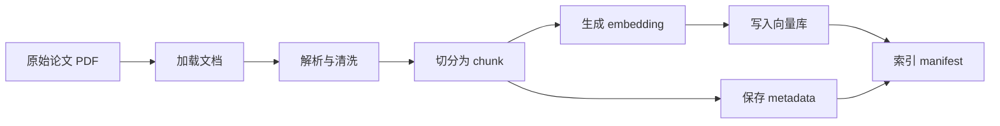
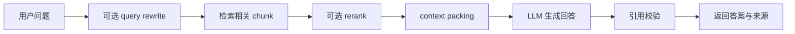

# 子模块 1：RAG 系统全链路与项目骨架概念教学

对应学习路线：模块 2《RAG 知识库与检索增强生成》子模块 1  
核心项目：`paper-rag-assistant`  
学习定位：第一次系统接触 RAG，先理解理论与工程全貌，再进入代码实现

---

## 1. 为什么需要 RAG

在模块 1 中，我们已经完成了一个可以调用工具的最小 Agent。这个 Agent 可以根据用户问题调用计算器、文件搜索、待办事项等工具。但如果用户问的是下面这些问题：

- “RAG 论文中通常如何评估 faithfulness？”
- “某篇论文对 agent memory 的定义是什么？”
- “请比较两篇论文对 retrieval augmentation 的不同观点。”
- “这篇论文的第 3 节提到了哪些关键方法？”

普通 LLM 很难可靠回答这些问题，原因有三个：

1. LLM 的训练数据不是实时更新的。
2. LLM 不一定见过你本地的论文、笔记或企业内部文档。
3. 即使模型知道一些相关内容，它也可能无法给出可验证的引用来源。

RAG 的目的就是解决这个问题：

> RAG，Retrieval-Augmented Generation，检索增强生成，是一种先从外部知识库检索相关资料，再把资料交给 LLM 生成答案的方法。

换句话说，RAG 不是让模型“凭记忆回答”，而是让模型“带着资料回答”。

一个简单类比：

- 普通 LLM 回答：像闭卷考试，模型依靠自己记忆回答。
- RAG 回答：像开卷考试，模型先查资料，再根据资料回答。

但是需要注意：RAG 只能降低幻觉风险，不能彻底消除幻觉。因为检索可能失败、资料可能有冲突、上下文可能组织不好、模型仍然可能过度推断。

---

## 2. RAG 的基本思想

RAG 的核心思想可以拆成两步：

1. Retrieval：根据用户问题，从知识库中找到相关内容。
2. Generation：把用户问题和检索到的内容一起交给 LLM，让模型生成答案。

最简形式如下：

```text
用户问题
  -> 检索器从知识库中找相关片段
  -> 把问题和片段放进 prompt
  -> LLM 基于片段生成答案
```

例如：

```text
用户问题：
RAG 中 rerank 的作用是什么？

检索结果：
片段 1：Reranking is used to reorder retrieved passages...
片段 2：A reranker can improve context precision...

最终 prompt：
请只根据下面资料回答问题。
资料：
[C1] Reranking is used to reorder retrieved passages...
[C2] A reranker can improve context precision...
问题：
RAG 中 rerank 的作用是什么？

模型回答：
Rerank 的作用是在初次召回后，对候选片段重新排序，让更相关的内容排在前面，从而提高进入上下文的资料质量 [C1][C2]。
```

这个例子里，模型不是直接凭空回答，而是基于 `[C1]` 和 `[C2]` 生成答案。

---

## 3. RAG 不是一个单函数

初学 RAG 时，很容易把它理解成：

```text
文档 -> 向量库 -> 问答
```

这个理解只对了一部分。真实工程中的 RAG 更像一条 pipeline：

```text
文档加载
  -> 文档解析
  -> 文本清洗
  -> 文本切分
  -> embedding
  -> 索引存储
  -> 查询改写
  -> 检索
  -> 重排
  -> 上下文组织
  -> 回答生成
  -> 引用校验
  -> 评测
```

任何一个环节做得不好，最终回答都会出问题。

举几个例子：

- PDF 解析失败：论文正文被解析成乱码，检索不到正确内容。
- chunking 太粗：一个 chunk 包含太多无关内容，检索虽然命中，但上下文噪声大。
- chunking 太细：关键定义被切开，模型看到的上下文不完整。
- embedding 模型不合适：语义相近的问题找不到对应片段。
- top-k 太大：大量无关 chunk 进入 prompt，模型被干扰。
- 没有 citation 校验：模型可能引用一个不存在的来源。
- 没有 evaluation：你只能凭感觉说“好像变好了”。

所以本模块的核心思想是：

> RAG 是一个可拆分、可观测、可评测、可替换的工程系统，而不是一个简单调用。

---

## 4. RAG 的五个核心阶段

学习路线中提到 RAG 的五个核心阶段：

1. loading
2. indexing
3. storing
4. querying
5. evaluation

下面逐个解释。

### 4.1 Loading：文档加载

Loading 是把原始文档读入系统。

原始文档可能是：

- PDF 论文
- Markdown 笔记
- HTML 网页
- Word 文档
- 企业知识库页面
- 数据库记录

在 `paper-rag-assistant` 中，主要文档来源是论文，所以最重要的是 PDF。

Loading 阶段要回答的问题：

- 文档从哪里来？
- 文档是什么格式？
- 文档能不能被读取？
- 文档的来源路径是什么？
- 文档是否有标题、作者、年份等元信息？

这一阶段的输出不是最终知识库，而是一个“原始文档对象”，例如：

```text
RawDocument
  doc_id: paper_001
  source_path: data/raw/papers/rag_survey.pdf
  file_type: pdf
  raw_bytes 或 raw_text
  metadata
```

### 4.2 Indexing：索引构建

Indexing 是把文档变成“可检索结构”的过程。

它通常包含：

1. 文档解析：从 PDF 中提取文字、页码、章节。
2. 文本清洗：去除页眉页脚、修复断行、处理乱码。
3. 文本切分：把长文档切成 chunk。
4. embedding：把 chunk 转成向量。
5. 建立索引：把向量和 metadata 写入存储。

Indexing 的目标不是“生成答案”，而是“让文档以后能够被查到”。

例如：

```text
PDF 论文
  -> ParsedDocument
  -> DocumentChunk 列表
  -> embedding 向量
  -> vector index
```

### 4.3 Storing：存储

Storing 是保存索引和文档 metadata。

RAG 系统里通常至少有两类存储：

1. 向量存储：保存 chunk embedding，用于相似度检索。
2. 元数据存储：保存 chunk 的文档来源、页码、章节、标题等信息。

这两类存储都很重要。

如果只有向量，没有 metadata，系统可能知道某个片段相似，但不知道它来自哪篇论文，也无法引用。

如果只有 metadata，没有向量，系统无法做语义检索。

在本项目中，一个 chunk 至少应该保存：

```text
chunk_id
doc_id
text
embedding
source_path
title
section
page_start
page_end
chunk_index
```

### 4.4 Querying：查询与问答

Querying 是用户真正提问时发生的流程。

它通常包含：

1. 接收用户问题。
2. 可选：改写问题，让它更适合检索。
3. 对问题生成 embedding。
4. 从向量库或 BM25 索引中找 top-k chunk。
5. 可选：rerank，把更相关的 chunk 排到前面。
6. 组织上下文。
7. 调用 LLM 生成答案。
8. 返回答案、引用和检索结果。

一个典型响应不应该只有字符串，而应该是结构化结果：

```text
RagAnswer
  answer: 中文回答
  citations: 引用来源列表
  retrieved_chunks: 检索到的 chunk
  trace_id: 请求追踪 ID
  latency_ms: 耗时
```

### 4.5 Evaluation：评测

Evaluation 是判断 RAG 系统好坏的过程。

没有评测时，你只能说：

```text
我感觉这个回答还不错。
```

有评测时，你可以说：

```text
启用 hybrid retrieval + rerank 后，HitRate@5 从 0.68 提升到 0.79，context precision 从 0.61 提升到 0.74，但平均延迟增加了 380ms。
```

这就是工程项目和 demo 的差异。

RAG 常见评测指标包括：

- HitRate@k：top-k 结果中是否命中目标文档或目标 chunk。
- Recall@k：目标资料有多少被召回。
- MRR：正确结果排得是否靠前。
- context precision：进入上下文的内容有多少是相关的。
- answer relevance：回答是否符合用户问题。
- faithfulness：回答是否忠实于检索上下文。

---

## 5. 离线索引流程与在线问答流程

RAG 系统通常分成两个流程：

1. 离线索引流程。
2. 在线问答流程。

这两条流程非常重要，必须分清。

### 5.1 离线索引流程

离线索引流程负责把文档变成可检索索引。



这个流程不需要每次用户提问都运行。

例如你有 30 篇论文，只要论文没有变化，就不需要每次问答都重新解析 PDF、重新生成 embedding。

### 5.2 在线问答流程

在线问答流程负责回答用户问题。



这个流程会在每次用户提问时运行。

### 5.3 为什么要拆开

离线索引和在线问答拆开，是因为它们的目标完全不同。

离线索引关注：

- 文档处理质量。
- 索引构建是否成功。
- embedding 是否缓存。
- 索引版本是否可追溯。

在线问答关注：

- 用户问题如何理解。
- 检索是否准确。
- 上下文是否足够。
- 回答是否有引用。
- 响应速度是否可接受。

如果把它们混在一起，会导致：

- 每次提问都重新处理文档，速度极慢。
- 索引配置无法复现。
- 错误难以定位。
- 无法做系统性评测。

---

## 6. RAG 与普通搜索的区别

RAG 很容易被误解成“搜索引擎 + LLM”。这个说法有一定道理，但不完整。

普通搜索通常返回文档列表：

```text
问题 -> 搜索 -> 返回相关页面
```

RAG 返回的是基于搜索结果生成的答案：

```text
问题 -> 搜索相关片段 -> 组织上下文 -> LLM 生成答案 -> 返回答案和引用
```

区别在于：

| 对比点 | 普通搜索 | RAG |
|---|---|---|
| 输出 | 文档列表或网页列表 | 自然语言答案和引用 |
| 重点 | 找到相关结果 | 基于结果回答问题 |
| 风险 | 用户自己判断结果 | 模型可能错误整合结果 |
| 评测 | 排名质量 | 检索质量 + 回答质量 |
| 工程链路 | 检索为主 | 检索、上下文、生成、引用、评测 |

这也是为什么 RAG evaluation 要同时评估检索和生成。

---

## 7. RAG 与微调的区别

另一个常见问题是：为什么不直接微调模型，而要做 RAG？

简单说：

- RAG 适合把外部知识“查出来”。
- 微调适合改变模型“怎么说、怎么做、怎么遵守格式”。

对论文知识库来说，RAG 更合适。

原因：

1. 论文内容会不断增加，RAG 可以更新索引，微调成本更高。
2. 用户需要引用来源，RAG 可以返回具体 chunk，微调很难保证来源。
3. 论文问答需要精确事实，RAG 可以把原文交给模型。
4. 你需要做实验比较检索策略，RAG 的各环节更容易观测。

但是 RAG 也不是万能的。

如果检索不到相关资料，LLM 仍然没有可靠依据。如果资料本身错误，RAG 也可能基于错误资料回答。如果用户问题需要复杂推理，RAG 只提供材料，不保证推理一定正确。

---

## 8. RAG 中的核心概念

### 8.1 Knowledge Base：知识库

知识库是 RAG 可以查询的外部资料集合。

在本项目中，知识库就是：

```text
AI Agent / RAG / LLM Security 相关论文
```

知识库不是简单文件夹，而应该包含：

- 原始文档。
- 解析后的文本。
- chunk。
- embedding。
- metadata。
- 索引版本。

### 8.2 Document：文档

Document 是知识库中的一个完整资料单位。

例如一篇论文：

```text
doc_id: paper_001
title: Retrieval-Augmented Generation for Knowledge-Intensive NLP Tasks
source_path: data/raw/papers/rag.pdf
file_type: pdf
metadata:
  authors: ...
  year: ...
```

文档太长，通常不能直接塞进 LLM prompt，也不适合直接检索，所以需要切分。

### 8.3 Chunk：文本片段

Chunk 是文档切分后的片段，是 RAG 检索的基本单位。

例如一篇 20 页论文可能被切成 100 个 chunk。

chunk 的好坏会直接影响检索质量。

一个好的 chunk 应该：

- 长度适中。
- 语义完整。
- metadata 完整。
- 可以追溯来源。
- 不包含过多无关内容。

### 8.4 Metadata：元数据

Metadata 是描述文档或 chunk 的结构化信息。

例如：

```text
title
authors
year
section
page_start
page_end
source_path
tags
```

metadata 的作用：

1. 支持引用溯源。
2. 支持过滤，例如只检索某一年之后的论文。
3. 支持调试，知道结果来自哪里。
4. 支持评测，判断是否命中目标文档。

如果没有 metadata，RAG 就很难成为可靠工程系统。

### 8.5 Embedding：向量表示

Embedding 是把文本转换成数字向量。

例如：

```text
"RAG uses retrieval to augment generation"
  -> [0.12, -0.34, 0.88, ...]
```

向量的意义是：语义相近的文本，在向量空间中距离也更近。

例如：

- “RAG 如何减少幻觉？”
- “检索增强生成如何降低 hallucination？”

这两个问题词面不同，但语义接近。好的 embedding 模型应该能让它们在向量空间中接近。

### 8.6 Vector Store：向量存储

Vector Store 用来保存 embedding，并支持相似度搜索。

常见选择：

- FAISS：本地、高性能、适合学习和实验。
- Chroma：上手简单，适合本地 RAG 原型。
- Qdrant：向量数据库，适合服务化。
- Milvus：更偏大规模向量检索。
- pgvector：把向量能力接入 PostgreSQL。

在初学阶段，我们更关注接口设计，而不是一开始追求复杂数据库。

### 8.7 Retriever：检索器

Retriever 根据用户问题找到相关 chunk。

常见检索器：

- Vector Retriever：基于 embedding 相似度。
- BM25 Retriever：基于关键词匹配。
- Hybrid Retriever：融合向量检索和关键词检索。

Retriever 的输出通常是 `RetrievedChunk` 列表。

### 8.8 Reranker：重排器

初次检索可能返回 20 个候选 chunk，但顺序不一定最好。

Reranker 的作用是重新判断这些 chunk 和用户问题的相关性，把更重要的内容排到前面。

典型流程：

```text
先召回 20 个 chunk
  -> rerank
  -> 选择前 5 个放进 prompt
```

Rerank 通常能提高上下文质量，但会增加延迟和成本。

### 8.9 Context Packing：上下文组织

Context Packing 是把检索到的 chunk 组织成最终 prompt 上下文。

它要解决的问题：

- 放哪些 chunk？
- 每个 chunk 用多长？
- 是否合并相邻 chunk？
- 如何避免重复？
- citation id 如何分配？
- token budget 是否超限？

这一步非常关键。即使检索结果是对的，如果上下文组织不好，模型也可能答错。

### 8.10 Citation：引用

Citation 是回答中的来源标记。

例如：

```text
RAG 通过检索外部文档来增强生成过程，从而降低模型凭空编造的风险 [C1]。
```

其中 `[C1]` 应该能映射到：

```text
论文标题
页码
章节
原文片段
source_path
```

引用不是装饰，而是 RAG 可信度的重要组成部分。

### 8.11 Trace：链路追踪

Trace 是一次请求的执行记录。

例如一次 `/ask` 请求的 trace 可以包含：

```text
trace_id
original_query
rewritten_query
retrieved_chunks
reranked_chunks
packed_context
llm_prompt
answer
citations
latency_ms
failure_type
```

Trace 的作用是帮助你定位错误。

没有 trace 时，回答错了你只能猜。

有 trace 时，你可以判断：

- 是 query rewrite 改错了吗？
- 是检索没有召回相关资料吗？
- 是 rerank 把正确结果排后面了吗？
- 是 context packing 丢掉了关键 chunk 吗？
- 是 LLM 没有遵守上下文吗？

---

## 9. 本项目中的核心数据模型

子模块 1 要先理解这些模型，不一定马上实现复杂逻辑。

### 9.1 RawDocument

表示系统刚读取到的原始文档。

用途：

- 保存文档来源。
- 标记文档类型。
- 为解析阶段提供输入。

示例字段：

```text
doc_id
source_path
file_type
raw_text 或 raw_bytes
metadata
created_at
```

### 9.2 ParsedDocument

表示已经解析和清洗后的文档。

用途：

- 保存可以切分的正文文本。
- 保存页码、章节等结构信息。
- 记录解析错误或解析质量。

示例字段：

```text
doc_id
title
text
sections
pages
metadata
parse_status
```

### 9.3 DocumentChunk

表示切分后的文本片段。

用途：

- 作为 embedding 和检索的基本单位。
- 保存引用所需 metadata。

示例字段：

```text
chunk_id
doc_id
text
section
page_start
page_end
token_count
chunk_index
metadata
```

### 9.4 RetrievedChunk

表示一次查询中被检索出来的 chunk。

用途：

- 保存检索分数。
- 标记来自哪个 retriever。
- 作为 rerank 和 context packing 的输入。

示例字段：

```text
chunk_id
doc_id
text
score
retriever
rank
section
page_start
page_end
```

### 9.5 Citation

表示回答中的引用来源。

用途：

- 让用户知道答案依据。
- 支持后续人工检查。

示例字段：

```text
citation_id
chunk_id
doc_id
title
section
page_start
page_end
snippet
```

### 9.6 RagAnswer

表示一次 RAG 问答的最终结果。

用途：

- 作为 `/ask` API 的响应结构。
- 同时返回答案、引用、检索片段和 trace。

示例字段：

```text
answer
citations
retrieved_chunks
trace_id
latency_ms
```

### 9.7 RagTrace

表示一次请求的完整执行链路。

用途：

- Debug。
- 评测。
- 日志。
- 失败归因。

示例字段：

```text
trace_id
query
rewritten_query
retrieval_strategy
top_k
rerank_enabled
retrieval_latency_ms
generation_latency_ms
final_status
failure_type
```

---

## 10. 配置分层

RAG 项目中会有很多配置。如果全部写死在代码里，后续实验会很痛苦。

建议至少分成五类配置。

### 10.1 模型配置

控制 LLM 和 embedding 模型。

例如：

```text
LLM_PROVIDER
LLM_MODEL
LLM_API_KEY
EMBEDDING_PROVIDER
EMBEDDING_MODEL
EMBEDDING_DIMENSION
```

### 10.2 索引配置

控制文档如何被切分和索引。

例如：

```text
CHUNK_SIZE
CHUNK_OVERLAP
CHUNKER_TYPE
INDEX_ID
INDEX_STORAGE_PATH
```

### 10.3 检索配置

控制查询时取哪些结果。

例如：

```text
RETRIEVAL_STRATEGY
TOP_K
VECTOR_TOP_K
BM25_TOP_K
HYBRID_ALPHA
```

### 10.4 生成配置

控制最终回答。

例如：

```text
ANSWER_LANGUAGE
MAX_CONTEXT_TOKENS
REQUIRE_CITATION
ALLOW_ABSTAIN
```

### 10.5 评测配置

控制实验运行。

例如：

```text
EVAL_DATASET_PATH
EVAL_OUTPUT_DIR
EVAL_TOP_K
EVAL_STRATEGY
```

配置分层的意义是：

- 方便实验对比。
- 方便测试。
- 方便部署。
- 方便记录每次实验到底用了什么参数。

---

## 11. 项目骨架为什么重要

RAG 初学项目很容易写成一个大脚本：

```text
load pdf -> split -> embed -> search -> ask llm
```

这样可以很快跑起来，但很快会遇到问题：

- 想换 PDF 解析器，会影响检索代码。
- 想换向量库，会影响 API 代码。
- 想比较 chunk size，没有地方记录 index version。
- 想做评测，发现中间结果没有保存。
- 想 debug，发现不知道 LLM 看到的上下文是什么。

所以我们从一开始就要把项目拆成模块。

建议理解为下面这几层：

```text
api 层：
  接收 HTTP 请求，返回响应，不直接实现 RAG 细节。

ingest 层：
  负责加载、解析、清洗、切分文档。

indexing 层：
  负责 embedding、向量索引、BM25 索引、索引 manifest。

retrieval 层：
  负责根据 query 找 chunk、融合结果、重排、组织上下文。

generation 层：
  负责 prompt、LLM 调用、答案生成、引用校验。

evaluation 层：
  负责评测数据集、指标、实验运行和报告。

storage 层：
  负责文档、chunk、索引、运行结果的持久化。
```

这不是为了显得复杂，而是为了让每个模块都能单独测试、替换和优化。

---

## 12. 子模块 1 中你需要形成的直觉

### 12.1 RAG 的上限由检索质量决定

如果检索不到正确资料，LLM 再强也只能猜。

所以 RAG 项目不能只看最终回答，还要看：

- 检索到了哪些 chunk？
- 正确 chunk 排第几？
- 无关 chunk 有多少？
- 进入 prompt 的 context 是否足够？

### 12.2 RAG 的可信度来自引用和可追溯性

RAG 的价值不只是回答问题，而是能告诉你答案来自哪里。

如果回答没有引用，或者引用无法映射回原文，那它只是一个普通聊天机器人。

### 12.3 RAG 的优化必须靠实验

chunk size、top-k、rerank、query rewrite 都没有固定最优值。

不同知识库、不同问题类型、不同模型都会影响结果。

所以工程上必须做 evaluation，而不是只凭肉眼看几个样例。

### 12.4 RAG 是外部知识系统，不是模型记忆系统

RAG 不是把知识“教会”模型，而是让模型在回答时“查阅”知识。

这意味着：

- 更新知识库比重新训练模型更容易。
- 可以保留引用来源。
- 可以按权限过滤文档。
- 可以记录检索过程。

---

## 13. 本子模块的学习目标检查

学完这份文档后，你应该能回答：

1. RAG 为什么能缓解 LLM 幻觉？
2. RAG 为什么不能彻底消除幻觉？
3. loading、indexing、storing、querying、evaluation 分别是什么意思？
4. 为什么要把离线索引和在线问答分开？
5. RawDocument、ParsedDocument、DocumentChunk、RetrievedChunk、Citation、RagAnswer、RagTrace 分别表示什么？
6. 为什么 metadata 对 RAG 很重要？
7. 为什么 RAG 系统需要 trace？
8. 为什么项目骨架要拆成 ingest、indexing、retrieval、generation、evaluation？
9. 为什么“把文档放进向量库”不是完整 RAG？
10. 如果一次回答错了，你会检查哪些环节？

---

## 14. 子模块 1 的实践准备

下一步进入代码练习时，我们会优先做这些事情：

1. 创建 `paper-rag-assistant` 的标准工程目录。
2. 定义核心数据模型。
3. 编写配置类和 `.env.example`。
4. 写一个最小的 pipeline trace 结构。
5. 先用 mock 数据跑通离线和在线流程的形状。

注意，这一步暂时不急着实现真实 PDF 解析、真实 embedding 和真实向量库。

原因是：子模块 1 的重点是理解 RAG 系统的结构。先把 pipeline 的形状搭起来，再逐步填充真实能力，会比一开始陷入 PDF 解析和向量库细节更稳。

---

## 15. 推荐你先画出的两张图

为了确认你真正理解子模块 1，建议你自己画两张图。

第一张：离线索引流程。

```text
raw document
  -> parsed document
  -> chunks
  -> embeddings
  -> vector index + metadata store
```

第二张：在线问答流程。

```text
query
  -> retrieval
  -> rerank
  -> context packing
  -> answer generation
  -> citation validation
  -> response
```

如果你能清楚说明这两张图中每个节点的输入和输出，子模块 1 的核心概念就基本建立起来了。

